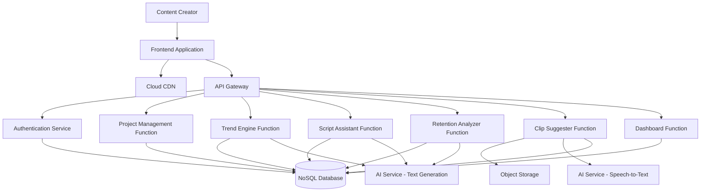

# Design Document: ContentForge

## Overview

ContentForge is a serverless, cloud-based AI-assisted content workflow platform built for digital content creators. The system leverages managed cloud services to provide scalable, reliable, and cost-effective content creation assistance through five core modules: Trend and Idea Engine, Script Assistant, Retention Risk Analyzer, Auto-Clip Suggestion Engine, and Performance Insight Dashboard.

The architecture follows a serverless design pattern with:
- Static frontend hosted on cloud CDN
- API Gateway for request routing and authentication
- Serverless compute functions for business logic
- Managed AI services for text generation, analysis, and transcription
- NoSQL database for metadata and structured data
- Object storage for video files
- Event-driven processing for asynchronous workflows

## Architecture

### High-Level Architecture



### Technology Stack (AWS)

**Frontend:**
- React with TypeScript for UI components
- Tailwind CSS for styling
- Axios for HTTP requests
- Hosted on AWS Amplify or S3 + CloudFront

**Backend:**
- AWS Lambda for serverless compute functions
- AWS API Gateway for REST API management
- Amazon DynamoDB for NoSQL database
- Amazon S3 for object storage (videos)
- Amazon Bedrock or OpenAI API for AI services
- Amazon Transcribe for speech-to-text transcription

**Infrastructure:**
- Amazon CloudFront for global content delivery
- Amazon CloudWatch for logging and monitoring
- AWS IAM for identity and access management
- AWS Secrets Manager for API keys and credentials
- AWS SAM or CloudFormation for Infrastructure as Code
- Amazon EventBridge for event-driven workflows

## Components and Interfaces

### 1. Authentication Service

**Purpose:** Manages user authentication, session management, and authorization.

**Interface:**
```typescript
interface AuthService {
  // Authenticate user with credentials
  authenticate(credentials: UserCredentials): Promise<AuthToken>
  
  // Validate session token
  validateToken(token: string): Promise<UserSession>
  
  // Refresh expired token
  refreshToken(refreshToken: string): Promise<AuthToken>
  
  // Revoke user session
  logout(token: string): Promise<void>
}

interface UserCredentials {
  email: string
  password: string
}

interface AuthToken {
  accessToken: string
  refreshToken: string
  expiresIn: number
}

interface UserSession {
  userId: string
  email: string
  expiresAt: number
}
```

**Implementation Notes:**
- Use JWT tokens for stateless authentication
- Store hashed passwords using bcrypt or Argon2
- Implement token expiration (15 minutes for access, 7 days for refresh)
- Use secure HTTP-only cookies for token storage in browser

### 2. Project Management Service

**Purpose:** Handles CRUD operations for user projects and associated metadata.

**Interface:**
```typescript
interface ProjectService {
  // Create new project
  createProject(userId: string, project: ProjectInput): Promise<Project>
  
  // Get all projects for user
  listProjects(userId: string): Promise<Project[]>
  
  // Get specific project
  getProject(userId: string, projectId: string): Promise<Project>
  
  // Update project
  updateProject(userId: string, projectId: string, updates: Partial<Project>): Promise<Project>
  
  // Delete project
  deleteProject(userId: string, projectId: string): Promise<void>
}

interface ProjectInput {
  name: string
  niche: string
  targetAudience: string
}

interface Project {
  projectId: string
  userId: string
  name: string
  niche: string
  targetAudience: string
  topic?: ContentTopic
  scripts: Script[]
  retentionAnalysis?: RetentionAnalysis
  videoMetadata?: VideoMetadata
  createdAt: string
  updatedAt: string
}
```

**Data Model:**
- Partition key: `userId`
- Sort key: `projectId`
- GSI for querying by creation date
- TTL for automatic cleanup of deleted projects (soft delete pattern)

### 3. Trend and Idea Engine

**Purpose:** Analyzes trends and generates content topic suggestions with predicted metrics.

**Interface:**
```typescript
interface TrendEngine {
  // Generate topic suggestions
  generateTopics(request: TopicRequest): Promise<TopicSuggestion[]>
  
  // Save selected topic to project
  saveTopicToProject(userId: string, projectId: string, topic: ContentTopic): Promise<void>
}

interface TopicRequest {
  niche: string
  targetAudience: string
  keywords?: string[]
  competitorUrls?: string[]
}

interface TopicSuggestion {
  title: string
  description: string
  predictedCTR: number // 0-100
  estimatedEngagement: EngagementMetrics
  competitiveness: 'low' | 'medium' | 'high'
  trendingScore: number // 0-100
  keywords: string[]
}

interface EngagementMetrics {
  estimatedViews: number
  estimatedLikes: number
  estimatedComments: number
  confidenceLevel: number // 0-100
}

interface ContentTopic {
  title: string
  description: string
  keywords: string[]
  selectedAt: string
}
```

**Implementation Strategy:**
- Use AI service to analyze niche and generate relevant topics
- Implement prompt engineering for consistent topic generation
- Cache trend data for 6 hours to reduce AI service costs
- Use keyword analysis APIs (optional) for enhanced predictions
- Simulate CTR and engagement predictions using heuristics for MVP

**AI Prompt Template:**
```
Analyze the following niche and target audience, then generate 5 content topic suggestions:

Niche: {niche}
Target Audience: {targetAudience}
Keywords: {keywords}

For each topic, provide:
1. Catchy title
2. Brief description (2-3 sentences)
3. Relevance to current trends
4. Key angles to explore

Format as JSON array.
```

### 4. Script Assistant

**Purpose:** Generates structured script drafts with editable sections.

**Interface:**
```typescript
interface ScriptAssistant {
  // Generate complete script draft
  generateScript(request: ScriptRequest): Promise<Script>
  
  // Regenerate specific section
  regenerateSection(scriptId: string, section: ScriptSection): Promise<SectionContent>
  
  // Save script to project
  saveScript(userId: string, projectId: string, script: Script): Promise<void>
  
  // Update script section
  updateSection(scriptId: string, section: ScriptSection, content: string): Promise<void>
}

interface ScriptRequest {
  topic: ContentTopic
  duration?: number // target duration in minutes
  tone?: 'casual' | 'professional' | 'energetic' | 'educational'
  platform?: 'youtube' | 'tiktok' | 'instagram'
}

interface Script {
  scriptId: string
  projectId: string
  hook: SectionContent
  introduction: SectionContent
  mainContent: SectionContent[]
  callToAction: SectionContent
  createdAt: string
  updatedAt: string
  version: number
}

interface SectionContent {
  section: ScriptSection
  content: string
  wordCount: number
  estimatedDuration: number // seconds
}

type ScriptSection = 'hook' | 'introduction' | 'main' | 'cta'
```

**Implementation Strategy:**
- Use AI service with structured prompts for each section
- Implement section-specific regeneration to preserve user edits
- Store script versions for undo capability
- Calculate word count and estimated duration (150 words/minute average)
- Validate script structure before saving

**AI Prompt Templates:**

*Hook Generation:*
```
Create an attention-grabbing hook for a {platform} video about: {topic}

Requirements:
- 1-2 sentences maximum
- Create curiosity or promise value
- Tone: {tone}
- Target audience: {targetAudience}

Return only the hook text.
```

*Main Content Generation:*
```
Create the main content outline for: {topic}

Requirements:
- 3-5 key points
- Each point with 2-3 supporting details
- Storytelling elements where appropriate
- Tone: {tone}
- Duration: approximately {duration} minutes

Format as structured sections.
```

### 5. Retention Risk Analyzer

**Purpose:** Analyzes scripts for potential engagement drop-off points.

**Interface:**
```typescript
interface RetentionAnalyzer {
  // Analyze script for retention risks
  analyzeScript(script: Script): Promise<RetentionAnalysis>
  
  // Save analysis to project
  saveAnalysis(userId: string, projectId: string, analysis: RetentionAnalysis): Promise<void>
}

interface RetentionAnalysis {
  analysisId: string
  scriptId: string
  overallScore: number // 0-100, higher is better
  riskSections: RiskSection[]
  recommendations: string[]
  analyzedAt: string
}

interface RiskSection {
  section: ScriptSection
  riskLevel: 'low' | 'medium' | 'high'
  riskScore: number // 0-100
  issues: RiskIssue[]
  suggestions: string[]
}

interface RiskIssue {
  type: 'pacing' | 'complexity' | 'length' | 'hook_strength'
  description: string
  severity: 'low' | 'medium' | 'high'
}
```

**Implementation Strategy:**
- Analyze multiple dimensions: pacing, complexity, section length, hook strength
- Use AI service for semantic analysis of content quality
- Implement rule-based checks for quantitative metrics:
  - Hook length (should be < 15 seconds / ~40 words)
  - Section length (should be < 90 seconds / ~225 words)
  - Sentence complexity (average words per sentence)
  - Transition quality between sections
- Combine AI analysis with rule-based scoring
- Generate actionable suggestions based on identified issues

**Analysis Algorithm:**
```
1. Calculate quantitative metrics:
   - Word count per section
   - Average sentence length
   - Estimated duration per section
   
2. AI semantic analysis:
   - Hook strength and curiosity gap
   - Content clarity and flow
   - Pacing and energy level
   
3. Risk scoring:
   - Hook: 30% weight
   - Introduction: 20% weight
   - Main content: 40% weight
   - CTA: 10% weight
   
4. Generate recommendations:
   - Prioritize high-risk sections
   - Provide specific, actionable suggestions
```

### 6. Auto-Clip Suggestion Engine

**Purpose:** Identifies impactful moments in uploaded videos for short-form content.

**Interface:**
```typescript
interface ClipSuggester {
  // Upload video file
  uploadVideo(userId: string, projectId: string, file: VideoFile): Promise<UploadResult>
  
  // Process video and generate clip suggestions
  processVideo(videoId: string): Promise<ClipSuggestion[]>
  
  // Get clip suggestions for video
  getClipSuggestions(videoId: string): Promise<ClipSuggestion[]>
}

interface VideoFile {
  filename: string
  contentType: string
  size: number
  data: Buffer | ReadableStream
}

interface UploadResult {
  videoId: string
  uploadUrl: string
  status: 'uploaded' | 'processing' | 'completed' | 'failed'
}

interface ClipSuggestion {
  clipId: string
  videoId: string
  startTime: number // seconds
  endTime: number // seconds
  duration: number // seconds
  confidence: number // 0-100
  reason: string
  transcript: string
  impactType: 'hook' | 'insight' | 'emotional' | 'actionable' | 'surprising'
}
```

**Implementation Strategy:**
- Upload video to object storage with signed URL
- Trigger asynchronous processing via event/queue
- Use speech-to-text service for transcription
- Analyze transcript for impactful moments using AI
- Store suggestions in database linked to video

**Processing Pipeline:**
```
1. Video Upload:
   - Validate file size (< 2GB)
   - Generate unique video ID
   - Upload to object storage
   - Create database record with status 'processing'

2. Transcription:
   - Submit video to speech-to-text service
   - Receive timestamped transcript
   - Store transcript in database

3. Analysis:
   - Segment transcript into potential clips (15-60 seconds)
   - Use AI to analyze each segment for impact
   - Score segments based on:
     * Emotional language
     * Actionable insights
     * Surprising information
     * Clear hooks or punchlines
   - Filter top 5-10 suggestions

4. Storage:
   - Save clip suggestions to database
   - Update video status to 'completed'
```

**AI Analysis Prompt:**
```
Analyze this video transcript and identify the most impactful moments for short-form content (15-60 seconds):

Transcript: {transcript}

For each impactful moment, provide:
1. Start and end timestamps
2. Why it's impactful (hook, insight, emotional, actionable, surprising)
3. Confidence score (0-100)
4. Brief description

Return top 10 moments as JSON array.
```

### 7. Performance Insight Dashboard

**Purpose:** Consolidates predictive metrics into actionable insights.

**Interface:**
```typescript
interface DashboardService {
  // Get dashboard data for project
  getDashboard(userId: string, projectId: string): Promise<DashboardData>
}

interface DashboardData {
  projectId: string
  projectName: string
  topic?: TopicInsights
  script?: ScriptInsights
  retention?: RetentionInsights
  clips?: ClipInsights
  overallScore: number // 0-100
  recommendations: string[]
  completionStatus: CompletionStatus
}

interface TopicInsights {
  title: string
  predictedCTR: number
  competitiveness: string
  trendingScore: number
  insight: string
}

interface ScriptInsights {
  wordCount: number
  estimatedDuration: number
  sectionsCompleted: number
  totalSections: number
  insight: string
}

interface RetentionInsights {
  overallScore: number
  highRiskSections: number
  topRecommendation: string
  insight: string
}

interface ClipInsights {
  totalSuggestions: number
  topClip?: ClipSuggestion
  insight: string
}

interface CompletionStatus {
  topicSelected: boolean
  scriptCreated: boolean
  retentionAnalyzed: boolean
  videoUploaded: boolean
  percentComplete: number
}
```

**Implementation Strategy:**
- Aggregate data from all modules for a project
- Calculate overall project score based on available metrics
- Generate contextual insights based on data completeness
- Provide next-step recommendations
- Cache dashboard data for 5 minutes to reduce database queries

**Insight Generation Logic:**
```
1. Topic Insights:
   - High CTR (>7%): "Strong topic choice with high click potential"
   - Medium CTR (4-7%): "Solid topic, consider optimizing title"
   - Low CTR (<4%): "Consider refining topic or angle"

2. Script Insights:
   - Complete script: "Script ready for retention analysis"
   - Incomplete: "Complete remaining sections: {list}"

3. Retention Insights:
   - Score >80: "Excellent retention potential"
   - Score 60-80: "Good structure, minor improvements suggested"
   - Score <60: "High drop-off risk, review recommendations"

4. Clip Insights:
   - Suggestions available: "Found {count} impactful moments"
   - No video: "Upload video to get clip suggestions"
```

### 8. API Layer

**Purpose:** Routes requests, handles authentication, and enforces rate limiting.

**API Endpoints:**

```
Authentication:
POST   /api/auth/login
POST   /api/auth/refresh
POST   /api/auth/logout

Projects:
GET    /api/projects
POST   /api/projects
GET    /api/projects/:projectId
PUT    /api/projects/:projectId
DELETE /api/projects/:projectId

Trend Engine:
POST   /api/projects/:projectId/topics/generate
POST   /api/projects/:projectId/topics/save

Script Assistant:
POST   /api/projects/:projectId/scripts/generate
POST   /api/projects/:projectId/scripts/:scriptId/sections/:section/regenerate
PUT    /api/projects/:projectId/scripts/:scriptId/sections/:section
POST   /api/projects/:projectId/scripts/save

Retention Analyzer:
POST   /api/projects/:projectId/scripts/:scriptId/analyze
GET    /api/projects/:projectId/retention-analysis

Clip Suggester:
POST   /api/projects/:projectId/videos/upload
GET    /api/projects/:projectId/videos/:videoId/clips

Dashboard:
GET    /api/projects/:projectId/dashboard
```

**Request/Response Format:**
- All requests use JSON
- All responses include standard envelope:
```typescript
interface APIResponse<T> {
  success: boolean
  data?: T
  error?: APIError
  timestamp: string
}

interface APIError {
  code: string
  message: string
  details?: any
}
```

**Rate Limiting:**
- Authenticated users: 100 requests per minute
- AI-intensive endpoints: 10 requests per minute
- Video uploads: 5 per hour
- Use token bucket algorithm
- Return 429 with Retry-After header when exceeded

### 9. Database Schema

**Users Table:**
```typescript
{
  PK: "USER#{userId}",
  SK: "PROFILE",
  email: string,
  passwordHash: string,
  createdAt: string,
  updatedAt: string
}
```

**Projects Table:**
```typescript
{
  PK: "USER#{userId}",
  SK: "PROJECT#{projectId}",
  projectId: string,
  name: string,
  niche: string,
  targetAudience: string,
  topic?: ContentTopic,
  createdAt: string,
  updatedAt: string,
  GSI1PK: "PROJECT#{projectId}", // For direct project access
  GSI1SK: "METADATA"
}
```

**Scripts Table:**
```typescript
{
  PK: "PROJECT#{projectId}",
  SK: "SCRIPT#{scriptId}",
  scriptId: string,
  hook: SectionContent,
  introduction: SectionContent,
  mainContent: SectionContent[],
  callToAction: SectionContent,
  version: number,
  createdAt: string,
  updatedAt: string
}
```

**Retention Analysis Table:**
```typescript
{
  PK: "PROJECT#{projectId}",
  SK: "ANALYSIS#{analysisId}",
  analysisId: string,
  scriptId: string,
  overallScore: number,
  riskSections: RiskSection[],
  recommendations: string[],
  analyzedAt: string
}
```

**Videos and Clips Table:**
```typescript
{
  PK: "PROJECT#{projectId}",
  SK: "VIDEO#{videoId}",
  videoId: string,
  filename: string,
  storageKey: string,
  status: string,
  transcript?: string,
  clipSuggestions: ClipSuggestion[],
  uploadedAt: string,
  processedAt?: string
}
```

## Data Models

### User Model
- Stores authentication credentials and profile information
- Password hashed using bcrypt with salt rounds = 12
- Email used as unique identifier

### Project Model
- Central entity linking all content creation artifacts
- Supports multiple scripts per project (versioning)
- Stores current topic selection and metadata

### Script Model
- Structured sections with independent editing
- Version tracking for undo capability
- Calculated fields: word count, estimated duration

### Analysis Model
- Immutable analysis results (new analysis = new record)
- Links to specific script version
- Stores both quantitative and qualitative assessments

### Video Model
- References object storage location
- Stores processing status for async workflows
- Embeds clip suggestions for quick retrieval

## Error Handling

### Error Categories

**1. Client Errors (4xx):**
- 400 Bad Request: Invalid input format or missing required fields
- 401 Unauthorized: Missing or invalid authentication token
- 403 Forbidden: User lacks permission for resource
- 404 Not Found: Resource doesn't exist
- 409 Conflict: Resource already exists or state conflict
- 413 Payload Too Large: File size exceeds limits
- 429 Too Many Requests: Rate limit exceeded

**2. Server Errors (5xx):**
- 500 Internal Server Error: Unexpected server error
- 502 Bad Gateway: Upstream service failure
- 503 Service Unavailable: Temporary service outage
- 504 Gateway Timeout: Upstream service timeout

### Error Handling Strategy

**Retry Logic:**
```typescript
interface RetryConfig {
  maxAttempts: number
  initialDelay: number // milliseconds
  maxDelay: number
  backoffMultiplier: number
}

// Default configuration
const defaultRetryConfig: RetryConfig = {
  maxAttempts: 3,
  initialDelay: 1000,
  maxDelay: 10000,
  backoffMultiplier: 2
}

// Retry for transient errors:
// - Network timeouts
// - 502, 503, 504 responses
// - AI service rate limits
```

**Error Logging:**
- Log all errors with context (userId, projectId, operation)
- Include stack traces for server errors
- Sanitize sensitive data before logging
- Use structured logging (JSON format)

**User-Facing Error Messages:**
```typescript
const errorMessages = {
  'AUTH_INVALID_CREDENTIALS': 'Invalid email or password. Please try again.',
  'AUTH_TOKEN_EXPIRED': 'Your session has expired. Please log in again.',
  'PROJECT_NOT_FOUND': 'Project not found. It may have been deleted.',
  'SCRIPT_GENERATION_FAILED': 'Unable to generate script. Please try again.',
  'VIDEO_TOO_LARGE': 'Video file exceeds 2GB limit. Please upload a smaller file.',
  'RATE_LIMIT_EXCEEDED': 'Too many requests. Please wait before trying again.',
  'AI_SERVICE_UNAVAILABLE': 'AI service temporarily unavailable. Please try again in a few moments.'
}
```

**Circuit Breaker Pattern:**
- Implement for AI service calls
- Open circuit after 5 consecutive failures
- Half-open state after 30 seconds
- Close circuit after 2 successful requests

## Testing Strategy

### Overview

ContentForge requires a dual testing approach combining unit tests for specific scenarios and property-based tests for universal correctness properties. This ensures both concrete functionality and general system behavior are validated.

### Unit Testing

**Focus Areas:**
- API endpoint request/response handling
- Authentication token validation
- Database query correctness
- Error handling for specific edge cases
- Integration between components

**Example Unit Tests:**
- User authentication with valid credentials returns token
- User authentication with invalid credentials returns 401
- Project creation stores all required fields
- Script generation includes all required sections
- Video upload rejects files over 2GB
- Rate limiting blocks requests after threshold

**Testing Framework:**
- Jest or Vitest for JavaScript/TypeScript
- Pytest for Python
- Mock external services (AI, database, storage)
- Use test fixtures for consistent data

### Property-Based Testing

**Configuration:**
- Minimum 100 iterations per property test
- Use fast-check (JavaScript), Hypothesis (Python), or equivalent
- Tag each test with feature name and property number
- Run property tests in CI/CD pipeline

**Test Data Generation:**
- Generate random valid projects, scripts, topics
- Generate edge cases: empty strings, maximum lengths, special characters
- Generate invalid inputs to test error handling
- Use shrinking to find minimal failing examples

### Integration Testing

**Focus Areas:**
- End-to-end workflows (create project → generate topic → create script → analyze)
- API Gateway → Lambda → Database integration
- File upload → Storage → Processing pipeline
- Authentication flow across multiple requests

### Performance Testing

**Metrics to Validate:**
- API response times under load
- Database query performance
- AI service call latency
- Video processing throughput
- Concurrent user handling

**Load Testing Scenarios:**
- 100 concurrent users creating projects
- 50 concurrent script generations
- 10 concurrent video uploads
- Sustained load over 10 minutes

### Security Testing

**Focus Areas:**
- SQL injection prevention (though using NoSQL)
- XSS prevention in user inputs
- Authentication bypass attempts
- Authorization checks for cross-user access
- Rate limiting effectiveness
- Token expiration and refresh

## Deployment Strategy

### Infrastructure as Code

Use AWS CloudFormation or AWS SAM to define:
- API Gateway configuration and stages
- Lambda functions with environment variables and layers
- DynamoDB tables with indexes and capacity settings
- S3 buckets with lifecycle policies and encryption
- IAM roles and policies with least privilege
- CloudWatch alarms, log groups, and dashboards
- EventBridge rules for async processing
- Cognito user pools for authentication

### CI/CD Pipeline

```
1. Code Commit
   ↓
2. Run Linters and Type Checks
   ↓
3. Run Unit Tests
   ↓
4. Run Property-Based Tests
   ↓
5. Build and Package
   ↓
6. Deploy to Staging
   ↓
7. Run Integration Tests
   ↓
8. Manual Approval (for production)
   ↓
9. Deploy to Production
   ↓
10. Run Smoke Tests
```

### Environment Configuration

**Development:**
- Local development with AWS SAM Local or LocalStack
- DynamoDB Local for database testing
- LocalStack for AWS service emulation
- Mock AI services to avoid costs

**Staging:**
- Full AWS deployment in separate account or region
- Separate DynamoDB tables and S3 buckets
- AI service with lower rate limits
- Automated testing after deployment

**Production:**
- Multi-region deployment (optional for HA)
- Production DynamoDB with point-in-time recovery
- Full AI service access (OpenAI or Bedrock)
- CloudWatch monitoring and alerting enabled
- Auto-scaling configured for Lambda and DynamoDB

### Monitoring and Observability

**Metrics to Track:**
- Request count and latency by endpoint
- Error rate by error type
- AI service call success rate and latency
- Database query performance
- Storage usage and costs
- Active user count

**Alerts:**
- Error rate > 5% for 5 minutes
- API latency > 3 seconds (p95)
- AI service failure rate > 10%
- Database connection errors
- Storage approaching quota

**Logging:**
- Structured JSON logs
- Log levels: DEBUG, INFO, WARN, ERROR
- Correlation IDs for request tracing
- Sensitive data redaction

## Security Considerations

### Authentication and Authorization

- JWT tokens with short expiration (15 minutes)
- Refresh tokens stored securely
- Token rotation on refresh
- Revocation list for compromised tokens

### Data Protection

- TLS 1.3 for all API communication
- Encryption at rest for database
- Encryption at rest for object storage
- Signed URLs for video access (1-hour expiration)
- Input validation and sanitization

### API Security

- Rate limiting per user and IP
- CORS configuration for frontend domain only
- API key rotation policy
- Request size limits
- SQL injection prevention (parameterized queries)

### Compliance

- GDPR: User data deletion within 30 days
- CCPA: Data access and deletion requests
- Data retention policies
- Privacy policy and terms of service
- Audit logging for data access

## Scalability Considerations

### Horizontal Scaling

- AWS Lambda scales automatically (up to account concurrency limits)
- DynamoDB: Use on-demand capacity mode or provisioned with auto-scaling
- S3: Inherently scalable with no limits
- CloudFront: Global distribution with automatic scaling

### Caching Strategy

- API Gateway caching for GET requests (5 minutes TTL)
- Application-level caching for trend data (6 hours TTL)
- Dashboard data caching (5 minutes TTL)
- CloudFront caching for static assets (1 year with versioning)
- DynamoDB DAX (optional) for sub-millisecond reads

### Cost Optimization

- Use DynamoDB on-demand pricing for unpredictable workloads
- Implement S3 lifecycle policies (archive to Glacier after 90 days)
- Optimize Lambda memory allocation for cost/performance balance
- Use Lambda reserved concurrency only when needed
- Monitor costs with AWS Cost Explorer and set budget alerts
- Batch AI service calls where possible to reduce API costs
- Use CloudFront with S3 origin to reduce data transfer costs

### Performance Optimization

- Minimize Lambda cold starts: Use provisioned concurrency for critical functions
- Optimize Lambda bundle sizes: Use Lambda layers for shared dependencies
- DynamoDB query optimization: Use indexes and sparse indexes
- Lazy loading for frontend components
- Image and video optimization before upload
- Use CloudFront edge locations for low-latency delivery
- Enable Lambda SnapStart for Java/Python functions (if applicable)

## MVP Scope for Hackathon

### Included Features

1. **User Authentication:** Basic email/password authentication
2. **Project Management:** Create, list, view, update, delete projects
3. **Trend Engine:** Generate topic suggestions with simulated metrics
4. **Script Assistant:** Generate and edit script drafts
5. **Retention Analyzer:** Analyze scripts with basic heuristics + AI
6. **Clip Suggester:** Upload video and get basic clip suggestions
7. **Dashboard:** Display consolidated metrics and insights

### Simplified Implementations

- **Authentication:** AWS Cognito for managed authentication service
- **Database:** Single-table design in Amazon DynamoDB
- **AI Service:** OpenAI API or Amazon Bedrock with simple prompts
- **Transcription:** Amazon Transcribe for video-to-text
- **Metrics:** Simulated CTR and engagement predictions
- **Video Processing:** Synchronous processing for small files only
- **No user registration:** Pre-created test accounts in Cognito

### Excluded from MVP

- User registration and email verification
- Password reset functionality
- Advanced analytics and historical tracking
- Multi-user collaboration
- Export functionality
- Mobile app
- Advanced AI fine-tuning
- Multi-language support

### Development Timeline (Hackathon)

**Day 1:**
- Set up infrastructure (4 hours)
- Implement authentication (2 hours)
- Implement project management (2 hours)

**Day 2:**
- Implement Trend Engine (3 hours)
- Implement Script Assistant (3 hours)
- Build basic frontend (2 hours)

**Day 3:**
- Implement Retention Analyzer (3 hours)
- Implement Clip Suggester (3 hours)
- Build dashboard UI (2 hours)

**Day 4:**
- Integration and testing (4 hours)
- Bug fixes and polish (2 hours)
- Demo preparation (2 hours)


## Correctness Properties

### What are Correctness Properties?

A property is a characteristic or behavior that should hold true across all valid executions of a system—essentially, a formal statement about what the system should do. Properties serve as the bridge between human-readable specifications and machine-verifiable correctness guarantees. Unlike unit tests that verify specific examples, property-based tests validate universal rules across many randomly generated inputs, helping catch edge cases and ensuring system-wide correctness.

### Property Reflection and Consolidation

After analyzing all 84 acceptance criteria, I identified several opportunities to consolidate redundant properties:

**Consolidated Authentication Properties:**
- Properties 1.1 (valid credentials) and 1.3 (session validation) both test authentication flow correctness and can be combined into a comprehensive authentication round-trip property

**Consolidated Data Structure Properties:**
- Properties 3.2 and 3.3 (CTR scores and engagement metrics in topics) can be combined into a single property about topic suggestion completeness
- Properties 5.2, 5.3, and 5.4 (retention score, risk sections, suggestions) can be combined into a single property about retention analysis completeness
- Properties 6.4 and 6.5 (timestamps/confidence and descriptions in clips) can be combined into a single property about clip suggestion completeness
- Properties 7.1, 7.2, and 7.3 (dashboard metrics) can be combined into a single property about dashboard data completeness

**Consolidated CRUD Properties:**
- Properties 2.1, 2.2, 2.3, 2.4 (project CRUD operations) share common patterns and can be tested through a comprehensive CRUD round-trip property

**Consolidated Error Handling Properties:**
- Properties 1.2, 9.3, 10.5, 13.1 all test error message quality and can be consolidated
- Properties 8.6, 10.4, 13.2 all test retry logic and can be consolidated

This reflection reduces 60+ testable properties to 35 unique, non-redundant properties that provide comprehensive coverage without duplication.

### Core Properties

#### Property 1: Authentication Round-Trip Consistency
*For any* valid user credentials, authenticating should return a valid token, and that token should successfully validate for subsequent requests until expiration.
**Validates: Requirements 1.1, 1.3**

#### Property 2: Invalid Credentials Rejection
*For any* invalid credentials (wrong password, non-existent email, malformed input), authentication should fail with a descriptive error message.
**Validates: Requirements 1.2**

#### Property 3: Project CRUD Round-Trip Consistency
*For any* valid project data, creating a project should store it with a unique ID, retrieving it should return the same data, updating it should persist changes, and deleting it should make it unretrievable.
**Validates: Requirements 2.1, 2.2, 2.3, 2.4**

#### Property 4: Project Data Model Completeness
*For any* created project, the stored data should include all required fields: projectId, userId, name, niche, targetAudience, and timestamps.
**Validates: Requirements 2.5**

#### Property 5: Project Authorization Enforcement
*For any* project and any two distinct users, user A should not be able to access, modify, or delete projects owned by user B.
**Validates: Requirements 2.6**

#### Property 6: Topic Generation Completeness
*For any* valid niche and target audience input, generated topic suggestions should include title, description, predicted CTR score, estimated engagement metrics, competitiveness rating, and keywords.
**Validates: Requirements 3.1, 3.2, 3.3**

#### Property 7: Topic Selection Persistence
*For any* generated topic suggestion, selecting and saving it to a project should make it retrievable as part of that project's data.
**Validates: Requirements 3.5**

#### Property 8: Topic Modification Persistence
*For any* selected topic, modifying its fields and saving should persist the modifications to the project.
**Validates: Requirements 3.6**

#### Property 9: Script Generation Completeness
*For any* valid topic, generating a script should return a structured script containing all required sections: hook, introduction, main content, and call-to-action.
**Validates: Requirements 4.1**

#### Property 10: Script Storage Persistence
*For any* generated script, saving it to a project should make it retrievable as part of that project's data.
**Validates: Requirements 4.2**

#### Property 11: Script Section Edit Isolation
*For any* script and any section, editing that section should persist the changes while leaving all other sections unchanged.
**Validates: Requirements 4.3**

#### Property 12: Script Section Regeneration Isolation
*For any* script and any section, regenerating that section should replace only that section's content while preserving all other sections.
**Validates: Requirements 4.4**

#### Property 13: Script Validation Enforcement
*For any* script missing required sections, attempting to save it should fail with a validation error, while scripts with all required sections should save successfully.
**Validates: Requirements 4.6**

#### Property 14: Retention Analysis Completeness
*For any* valid script, analyzing it should return results containing overall score, risk sections with risk levels, identified issues (pacing, complexity, length, hook strength), and actionable suggestions.
**Validates: Requirements 5.1, 5.2, 5.3, 5.4**

#### Property 15: Video Upload and Storage Association
*For any* valid video file under 2GB, uploading it should store the file in object storage and associate it with the specified project.
**Validates: Requirements 6.1**

#### Property 16: Video Processing Pipeline Completeness
*For any* uploaded video, the processing pipeline should transcribe the audio, analyze the content, and generate clip suggestions with all required fields.
**Validates: Requirements 6.2, 6.3**

#### Property 17: Clip Suggestion Completeness
*For any* generated clip suggestion, it should include start time, end time, duration, confidence score, reason/description, transcript excerpt, and impact type.
**Validates: Requirements 6.4, 6.5**

#### Property 18: Dashboard Data Completeness
*For any* project with available data, the dashboard should include all applicable metrics: predicted CTR, retention strength, topic competitiveness, and completion status.
**Validates: Requirements 7.1, 7.2, 7.3**

#### Property 19: Dashboard Incomplete Data Handling
*For any* project with missing data (no topic, no script, no analysis, or no video), the dashboard should indicate which metrics are unavailable and provide appropriate messaging.
**Validates: Requirements 7.5**

#### Property 20: Data Storage Round-Trip Consistency
*For any* valid data (project metadata, user data, analysis results), storing it in the database and then retrieving it should return equivalent data.
**Validates: Requirements 8.1**

#### Property 21: Secure Video URL Generation
*For any* stored video file, generating an access URL should produce a time-limited, secure URL that expires after the specified duration.
**Validates: Requirements 8.4**

#### Property 22: Storage Operation Retry on Failure
*For any* transient storage failure, the system should automatically retry the operation up to the configured maximum attempts before returning an error.
**Validates: Requirements 8.6**

#### Property 23: API Request Validation
*For any* API request, the system should validate the request format and authentication token before processing, rejecting invalid requests with appropriate error codes.
**Validates: Requirements 9.1**

#### Property 24: API Request Routing Correctness
*For any* valid API request, the API layer should route it to the correct compute function based on the endpoint path and HTTP method.
**Validates: Requirements 9.2**

#### Property 25: API Error Response Format
*For any* invalid API request, the response should include a descriptive error message, appropriate HTTP status code, and no internal system details.
**Validates: Requirements 9.3, 9.7**

#### Property 26: Rate Limiting Enforcement
*For any* user making requests, after exceeding the rate limit threshold, subsequent requests should receive 429 status codes with retry-after information until the rate limit window resets.
**Validates: Requirements 9.4, 9.5**

#### Property 27: AI Service Response Format Validation
*For any* AI service request (text generation, analysis, transcription), the response should match the expected format with all required fields present.
**Validates: Requirements 10.1, 10.2, 10.3**

#### Property 28: AI Service Retry Logic
*For any* failed AI service request due to transient errors, the system should retry up to 3 times with exponential backoff before returning an error.
**Validates: Requirements 10.4**

#### Property 29: AI Service Final Error Handling
*For any* AI service request that fails after all retry attempts, the system should return a user-friendly error message and log the failure details.
**Validates: Requirements 10.5**

#### Property 30: AI Service Timeout Enforcement
*For any* AI service request, if the request exceeds the configured timeout duration, the system should cancel the request and return a timeout error.
**Validates: Requirements 10.6**

#### Property 31: Cache Correctness
*For any* cacheable data, retrieving it from cache should return the same data as retrieving it from the database.
**Validates: Requirements 11.5**

#### Property 32: Cache Invalidation
*For any* cached data that becomes stale (exceeds TTL or underlying data changes), subsequent requests should retrieve fresh data from the database.
**Validates: Requirements 11.6**

#### Property 33: Input Sanitization
*For any* user input containing potentially malicious content (SQL injection patterns, XSS scripts, command injection), the system should sanitize or reject the input before processing.
**Validates: Requirements 12.4**

#### Property 34: Data Deletion Completeness
*For any* user requesting data deletion, all associated data (projects, scripts, analyses, videos) should be removed from the system.
**Validates: Requirements 12.7**

#### Property 35: Error Message Presence
*For any* error condition, the system should return a response containing a descriptive error message that indicates what went wrong.
**Validates: Requirements 13.1**

#### Property 36: Transient Error Retry with Backoff
*For any* transient error (network timeout, temporary service unavailability), the system should retry with exponentially increasing delays between attempts.
**Validates: Requirements 13.2**

#### Property 37: Error Logging with User-Friendly Messages
*For any* critical error, the system should log detailed technical information while returning a user-friendly message to the client.
**Validates: Requirements 13.3**

#### Property 38: Asset Caching Headers
*For any* static asset request, the response should include appropriate cache-control headers to enable browser and CDN caching.
**Validates: Requirements 14.3**

#### Property 39: Asset Compression
*For any* compressible static asset (JavaScript, CSS, HTML), the response should be served with compression (gzip or brotli) when the client supports it.
**Validates: Requirements 14.4**

### Edge Case Properties

These properties focus on boundary conditions and special cases:

#### Edge Case 1: Expired Token Rejection
*For any* authentication token that has exceeded its expiration time, requests using that token should be rejected with a 401 status code.
**Validates: Requirements 1.4**

#### Edge Case 2: Empty Script Analysis Rejection
*For any* script with no content or only whitespace, attempting to analyze it should return an error indicating insufficient content.
**Validates: Requirements 5.6**

#### Edge Case 3: Video Size Limit Enforcement
*For any* video file exactly at or under 2GB, upload should succeed, while files over 2GB should be rejected with a descriptive error.
**Validates: Requirements 6.6, 6.7**

### Example-Based Tests

These specific scenarios are best tested with concrete examples rather than property-based generation:

#### Example 1: Health Check Endpoint
The health check endpoint should return a 200 status code with a response indicating service health when all dependencies are operational.
**Validates: Requirements 13.4**

### Testing Implementation Notes

**Property-Based Testing Configuration:**
- Use fast-check (JavaScript/TypeScript) or Hypothesis (Python)
- Run minimum 100 iterations per property test
- Configure shrinking to find minimal failing examples
- Tag each test: `Feature: content-forge, Property N: [property title]`

**Test Data Generators:**
- Valid credentials: random email + password combinations
- Invalid credentials: malformed emails, empty passwords, SQL injection attempts
- Projects: random names, niches, audiences with valid and invalid characters
- Topics: random titles, descriptions, keywords, CTR scores (0-100)
- Scripts: random content with varying lengths, sections, word counts
- Videos: mock video files with varying sizes (under/over limits)
- Timestamps: random valid and expired token timestamps

**Mocking Strategy:**
- Mock AI service responses with realistic data structures
- Mock database operations for unit tests
- Mock object storage for upload/download tests
- Use real services for integration tests

**Coverage Goals:**
- 100% of correctness properties implemented as property-based tests
- 100% of edge cases covered
- 80%+ code coverage from all tests combined
- All API endpoints covered by integration tests
